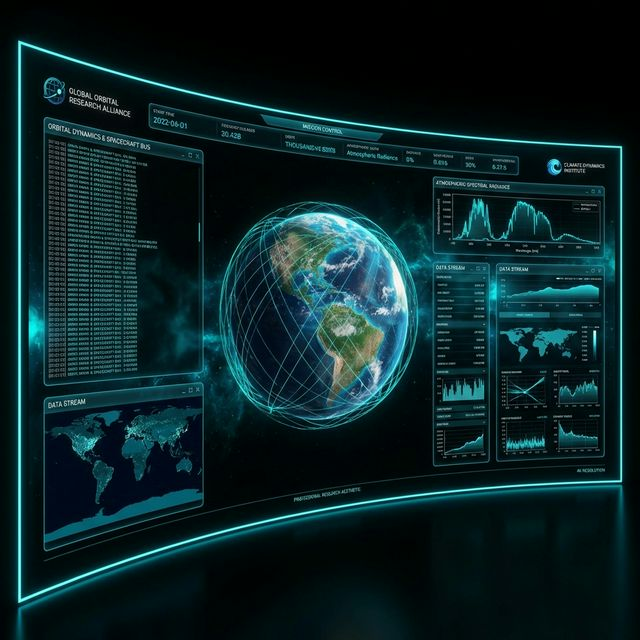
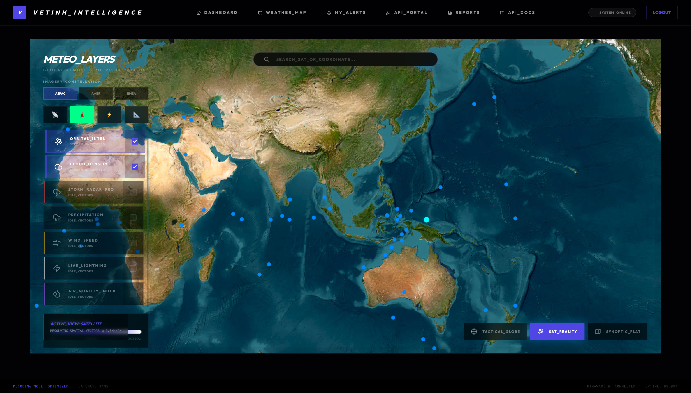
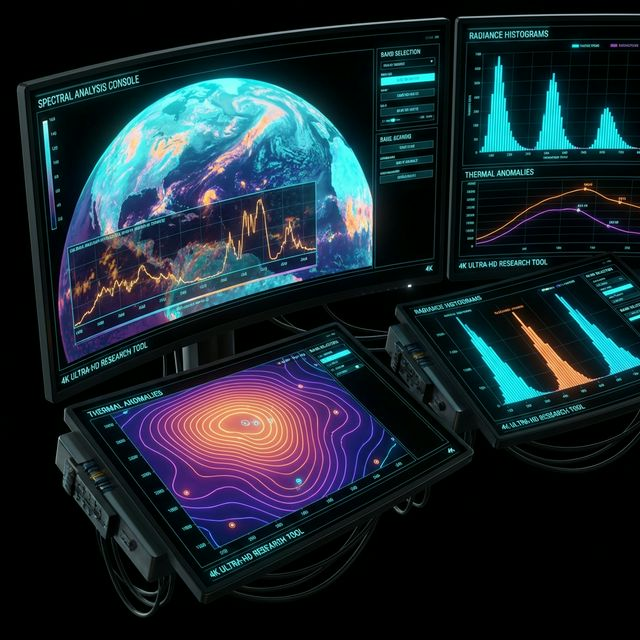

# StarWeather System (Satellite Project)
## Orbital Mechanics Analysis & Integrated Meteorological Intelligence Platform



[](https://en.wikipedia.org/wiki/Simplified_perturbations_models)
[](https://laravel.com)
[](https://threejs.org)

**StarWeather** is a large-scale data analysis ecosystem designed to solve complex problems at the intersection of celestial mechanics and atmospheric dynamics. The system provides a unified solution for tracking Low Earth Orbit (LEO) objects and analyzing extreme weather phenomena based on real-time multispectral data.

---

## [ARCH] System Architecture & Engineering Layers

The project is built on a **"Data-Centric Architecture"** philosophy, prioritizing high-performance data processing without virtualization dependencies (Non-Dockerized) to maximize hardware I/O resources.

### 1. Ingestion & ETL Layer
The system implements automated data pipelines for converging data from decentralized sources:
- **Orbital Ingestion**: Automatically synchronizes Two-Line Element (TLE) sets from NORAD via secure API protocols.
- **Meteorological Stream**: Analyzes image streams from the Himawari-9 (JMA) geostationary satellite at 10-minute intervals.
- **Radar Mosaic Integration**: Merges radar tiles from RainViewer to create a seamless global precipitation map.

### 2. Computational Dynamics Engine
The core of StarWeather consists of pure mathematical models optimized using PHP 8.3 JIT:

### Aerospace Mechanics
- **SGP4 Propagation Model**: Solves perturbation equations to predict satellite positions. The algorithm processes Keplerian elements (Inclination, Eccentricity, RAAN) to determine state vectors $(r, v)$ in the ECI reference frame.
- **Vis-Viva Equation**: Calculates instantaneous orbital velocity:
  $$v = \sqrt{\mu \left( \frac{2}{r} - \frac{1}{a} \right)}$$
- **WGS84 Reference Frame**: Converts coordinates from ECI space to geographic Lat/Lng/Alt using Earth-shaping constants (Semi-major axis $a = 6378.137\text{ km}$, Flattening $f = 1/298.257$).



### Meteorological Physics & Multispectral Analysis
- **Himawari Bandwidth Analysis**: The system processes Infrared (IR) spectral bands to determine cloud-top temperatures. The **Spectral Normalization** algorithm helps isolate areas at risk of cyclogenesis.
- **Vortex Identification**: Uses pressure gradient and wind velocity field analysis methods to identify storm centers.
- **Storm Track Forecasting**: Applies Vector Interpolation models on time series data to outline potential movement paths.



### Quantitative Risk Assessment Engine (Deterministic Risk Engine)
The system relies on mathematical formulas rather than intuition to quantify risk:
- **Weighted Sum Function**:
  $$RiskScore = \sum (Weight_i \times NormalizedValue_i)$$
- **Confidence Index**: Each risk point is assigned a confidence level based on data freshness (Data Freshness Score) and convergence between different sensor sources.

---

## [TECH] Core Stack

| Layer | Technology & Standards |
|---|---|
| **Back-end Core** | Laravel 11 (Enterprise-optimized Skeleton), PHP 8.3 JIT |
| **Real-time Pipeline** | Laravel Reverb (High-speed WebSocket protocol for orbital data) |
| **Data Persistence** | MySQL 8.0 (Partitioned Tables), Redis (L1 State Cache) |
| **Front-end / GIS** | Vue 3, Inertia.js, Three.js (WebGL Engine) |
| **GIS Visuals** | Globe.gl (UV Spherical Mapping for WGS84 data) |

---

## [DEPLOY] Deployment Guide

### Infrastructure Requirements
- **PHP**: Version 8.2 or higher with extensions: `bcmath`, `gmp`, `redis`.
- **Database**: MySQL 8.0 with JSON/Spatial modules.
- **Memory Store**: Redis server for queue management and state caching.

### Installation Process
```bash
# Step 1: Initialize source code and libraries
git clone https://github.com/creyt2012/vetinh.git
composer install && npm install

# Step 2: Configure environment parameters
cp .env.example .env
php artisan key:generate

# Step 3: Database migration and seeding
php artisan migrate --seed

# Step 4: Launch integrated system (Concurrently)
# Runs Web Server, Queue Worker, and Vite Compiler simultaneously
npm run dev

# Step 5: Activate 1Hz real-time data stream (Required for HUD/Dashboard)
php artisan satellite:monitor
```

---

## [ROADMAP] Scientific Roadmap
- [ ] Integrate machine learning (LSTM) for non-linear storm track forecasting.
- [ ] Implement Ionospheric Plasma density measurement to analyze effects on satellite communication signals.
- [ ] Dedicated Dashboard for professional disaster response agencies.

---
**A research and development product by the StarWeather Core Engineering Team.**  
*Leveraging space intelligence to protect life on the planetary surface.*
