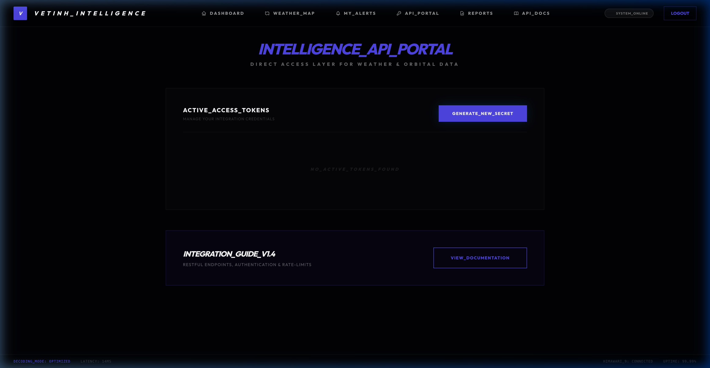
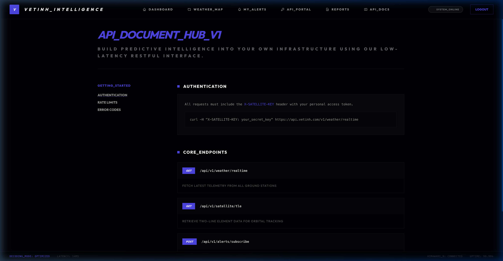

# API Reference (V1 Full Catalog)

The StarWeather system provides standard RESTful Application Programming Interfaces (APIs). Below is a detailed directory of all currently available endpoints.

## [AUTH] Authentication

All requests require an `X-API-KEY` Header. You can manage your API keys in your Portals section.

```http
X-API-KEY: your_api_key_here
```

---



## [LIVE] System Status (Live State)

| Method | Endpoint | Description |
| :--- | :--- | :--- |
| `GET` | `/api/v1/live/state` | General status of sensor and satellite networks. |
| `GET` | `/api/v1/health` | Readiness status check (Liveness check). |
| `GET` | `/api/v1/health/system`| Detailed infrastructure metrics (DB, Redis, RAM). |

---

## [SAT] Satellites & Orbits

| Method | Endpoint | Description |
| :--- | :--- | :--- |
| `GET` | `/api/v1/satellites/live` | List of all satellites and their current positions. |
| `GET` | `/api/v1/satellites/conjunctions` | Warnings for dangerous orbital crossing points. |
| `GET` | `/api/v1/satellites/{id}/telemetry` | Real-time telemetry data for a single satellite. |
| `GET` | `/api/v1/satellites/imagery-history` | Satellite image history (Time-machine). |
| `GET` | `/api/v1/satellites/{id}/tle` | Raw TLE (Two-Line Element) data for a satellite. |

---

## [MET] Meteorology & Forecasting (Weather)

| Method | Endpoint | Description |
| :--- | :--- | :--- |
| `GET` | `/api/v1/weather/latest` | Latest meteorological metrics from the nearest sensor. |
| `GET` | `/api/v1/weather/metrics` | Query historical data over time. |
| `GET` | `/api/v1/weather/ground-stations`| List and status of ground stations. |
| `GET` | `/api/v1/weather/history` | Detailed meteorological history at a coordinate. |
| `GET` | `/api/v1/weather/heatmap` | Distribution density data for heatmaps. |
| `GET` | `/api/v1/weather/forecast` | AI forecast for the next 48 hours (Hourly). |
| `GET` | `/api/v1/weather/point-info` | Deep analysis at a point (SST, AQI, UV). |
| `GET` | `/api/v1/weather/trends` | Climate trends over the past 30 days. |

---

## [STORM] Disaster Tracking (Storms & Risk)

| Method | Endpoint | Description |
| :--- | :--- | :--- |
| `GET` | `/api/v1/weather/storms` | List of active depressions and storms. |
| `GET` | `/api/v1/weather/storms/{id}` | Detailed parameters on wind speed, storm path. |
| `GET` | `/api/v1/weather/storms/{id}/vortex`| Analysis of core and eye wall structures. |
| `GET` | `/api/v1/weather/risk-areas` | Areas within Red Warning zones. |

---

## [ALRT] Warning Logic (Alerts)

| Method | Endpoint | Description |
| :--- | :--- | :--- |
| `GET` | `/api/v1/alerts/rules` | List of warning rules (Condition Engine). |
| `POST`| `/api/v1/alerts/rules` | Create a new alert logic rule. |
| `GET` | `/api/v1/alerts/history` | Log of notifications sent to users. |

---

## [OPS] Mission Control

| Method | Endpoint | Description |
| :--- | :--- | :--- |
| `GET` | `/api/v1/mission-control/files` | Manage files transmitted from satellites to stations. |
| `POST`| `/api/v1/mission-control/upload`| Upload files to the data center. |
| `GET` | `/api/v1/reports` | Periodic scientific report repository (PDF/JSON). |
| `GET` | `/api/v1/reports/{file}/download`| Download detailed reports. |

---

## [FIN] Billing & Marine

| Method | Endpoint | Description |
| :--- | :--- | :--- |
| `GET` | `/api/v1/marine/vessels` | Vessel tracking integrated with AIS data. |
| `GET` | `/api/v1/plans` | Information on PRO/Enterprise plans. |
| `POST`| `/api/v1/payments/checkout` | Initialize account upgrade transactions. |

---

## [ADM] Satellites & Ground Stations (Admin Assets)

Endpoints for the administrative area, requiring `admin` permissions.

| Method | Endpoint | Description |
| :--- | :--- | :--- |
| `GET` | `/admin/satellites` | List satellites in the management system. |
| `POST`| `/admin/satellites` | Register a new satellite into the network. |
| `PUT` | `/admin/satellites/{satellite}` | Update TLE parameters or satellite status. |
| `GET` | `/admin/ground-stations` | Manage global ground station infrastructure. |
| `POST`| `/admin/ground-stations` | Set up a new transceiver station. |

---

## [ADM] System & User Administration (System Admin)

| Method | Endpoint | Description |
| :--- | :--- | :--- |
| `GET` | `/admin/users` | List of users and access permissions. |
| `POST`| `/admin/users` | Create new user/enterprise accounts. |
| `GET` | `/admin/api-keys` | Manage and revoke customer API keys. |
| `GET` | `/admin/system/audit-logs` | Activity logs and system change tracking. |
| `GET` | `/admin/system/health` | Detailed SLA monitoring and hardware health. |

---

## [ADM] Finance & Alert Settings (Billing & Alert Settings)

| Method | Endpoint | Description |
| :--- | :--- | :--- |
| `GET` | `/admin/billing` | Manage invoices and revenue from SaaS plans. |
| `GET` | `/admin/alerts/settings` | Configure threshold parameters for the Risk Engine. |
| `GET` | `/admin/alerts/rules` | Manage default system-wide logical rules. |

---

## [INT] Tactical Map API (Internal Map)

| Endpoint | Description | Parameters |
| :--- | :--- | :--- |
| `/api/internal-map/satellites` | High-speed satellite data stream. | `token` |
| `/api/internal-map/ground-stations`| Ground station rendering. | `token` |
| `/api/internal-map/storms` | Real-time storm overlay. | `token` |
| `/api/internal-map/point-info` | Point-of-click information on the Globe. | `lat`, `lng`, `token` |
| `/api/internal-map/forecast` | Forecast for Meteogram dashboard. | `lat`, `lng`, `token` |



---

## [AI] AI Core Microservice (:8001)

| Method | Endpoint | Description |
| :--- | :--- | :--- |
| `POST` | `/analyze` | Satellite spectral image analysis. |
| `GET` | `/` | Liveness & Heartbeat of AI Core. |

---

## [SYS] Infrastructure & Operations

| Method | Endpoint | Description |
| :--- | :--- | :--- |
| `GET` | `/horizon` | Dashboard for queue and worker management. |
| `GET` | `/up` | Laravel Health Check (V8.3+). |
| `GET` | `/sanctum/csrf-cookie` | Initialize authentication cookie for SPA/Frontend. |

---
[🏠 Home](Home) | [🏗️ Architecture](Architecture) | [🚀 Algorithms](Algorithms)
