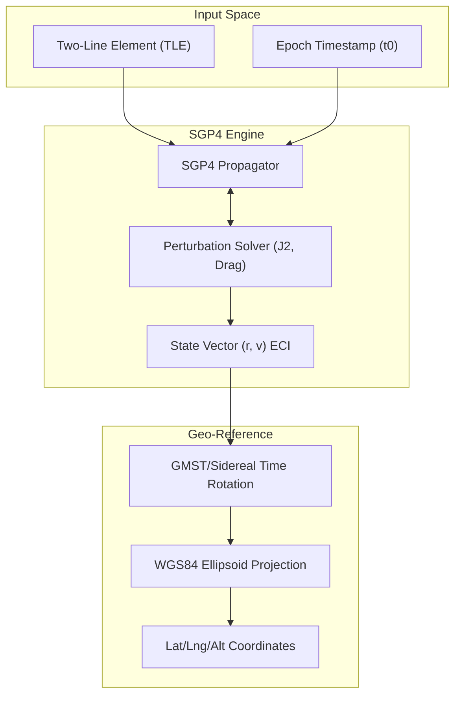
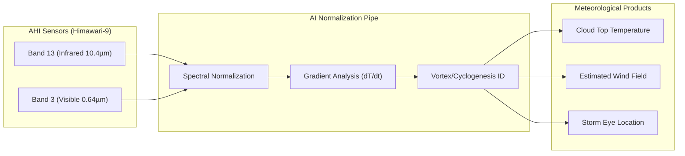
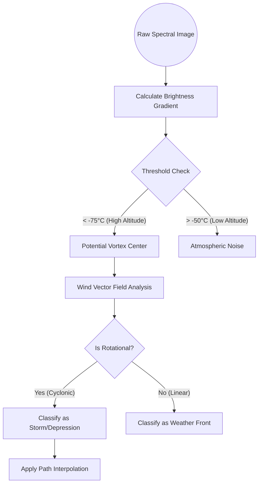
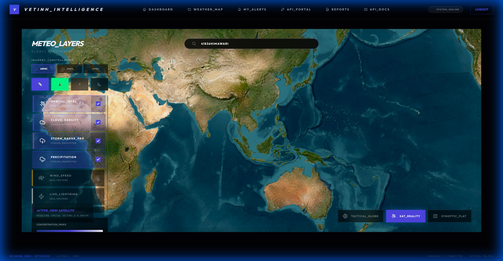

# Analysis of Algorithms & Advanced Mathematical Models

The StarWeather system is operated by international standard aerospace and atmospheric physics models, ensuring consistency and accuracy of the output data.

---

## 1. Orbital Dynamics

The system uses numerical simulation methods to determine the state of satellites in three-dimensional space.

### 1.1. SGP4 Propagation (Simplified General Perturbations)
The SGP4 algorithm solves differential equations of motion taking into account major perturbative forces:
- Earth's Oblateness ($J_2$): Effect of the non-spherical shape on the orbit.
- Atmospheric Drag: Particularly important for satellites in Low Earth Orbit (LEO).

**Key input parameters from TLE:**
- Inclination ($i$): Angle between the orbital plane and the equatorial plane.
- RAAN ($\Omega$): Right Ascension of the Ascending Node, defining the orientation of the orbital plane in space.
- Eccentricity ($e$): The "out-of-roundness" of the orbit (0 for a perfect circle).

### 1.2. Instantaneous Velocity Calculation (Vis-Viva Equation)
The speed of the satellite at any point in its orbit is calculated as a function of the distance to the Earth's center:
$$v = \sqrt{\mu \left(2/r - 1/a \right)}$$
Where:
- $\mu$: Earth's gravitational constant ($398600.44\text{ km}^3/\text{s}^2$).
- $r$: Instantaneous distance from the satellite to the Earth's center.
- $a$: Semi-major axis of the elliptical orbit.

### 1.3. WGS84 Reference Frame & Rotation Compensation
Because the Earth rotates on its axis, a fixed point in Inertial space (ECI) will have geographic coordinates that change over time. We use **Greenwich Mean Sidereal Time (GMST)** to perform coordinate rotation:
$$lng = \alpha - GMST$$
where $\alpha$ is the satellite's Right Ascension.

---

## 1. Orbital Dynamics (Space-to-Ground Pipeline)

Hệ thống sử dụng các phương pháp mô phỏng số để xác định trạng thái của vệ tinh trong không gian ba chiều.

---

## 2. Meteorological Spectral Processing (Sensor-to-Metric Pipeline)

### 2.1. Himawari Multispectral Bandwidth Analysis
Data from the AHI (Advanced Himawari Imager) sensor is processed through two main channels:
- Infrared Channel (Band 13 - 10.4µm): Used to determine the brightness temperature of the cloud tops. Lower temperatures correspond to higher and thicker clouds (higher risk of intense storms).
- Visible Channel (Band 3 - 0.64µm): Used to analyze cloud surface structures and Albedo reflectivity.

### 2.2. XYZ Radar Mosaic Algorithm
To maintain display performance, precipitation radar data is distributed as 256x256 pixel tiles. The system uses Bilinear Interpolation algorithms to ensure the edges of the radar tiles match perfectly on the 3D globe.

---

## 3. Cyclogenesis Identification & Forecasting (Vortex ID)

The system implements an automated scanning tool (`StormTrackingService`) to detect atmospheric anomalies:
- Gradient Analysis: Calculates the rate of pressure change over time ($dP/dt$).
- Vector Interpolation Model: Forecasts future satellite positions based on solar and atmospheric perturbation parameters.

---

### [LOGIC] Vortex Identification Logic

---

## 4. Strategic Satellite Network

The StarWeather system utilizes the most advanced mathematical and physical models to process remote sensing data.

### 4.1. Imagery Group (Providing Images)
Currently, the system uses **Himawari-9** as its primary source for Full Disk images, updated every 10 minutes. This satellite has the highest spectral resolution in the Asia-Pacific region.

### 4.2. Telemetry Group (Providing Coordinates & Remote Sensing)
The system synchronizes real-time TLE data for over **14 leading meteorological satellites** worldwide for display on the 3D map:
- **USA (NOAA)**: GOES-16, GOES-17, GOES-19, NOAA-19/20/21.
- **Europe (EUMETSAT)**: METOP-B/C, METEOSAT-9.
- **Japan (JMA)**: HIMAWARI-8, HIMAWARI-9.
- **China (CMA)**: FENGYUN-3D, FENGYUN-3F.

> [!TIP]
> Combining TLE data from CelesTrak and satellite imagery from JMA allows StarWeather to create an accurate dynamic map between the physical location of the equipment and the weather phenomena they are observing.
