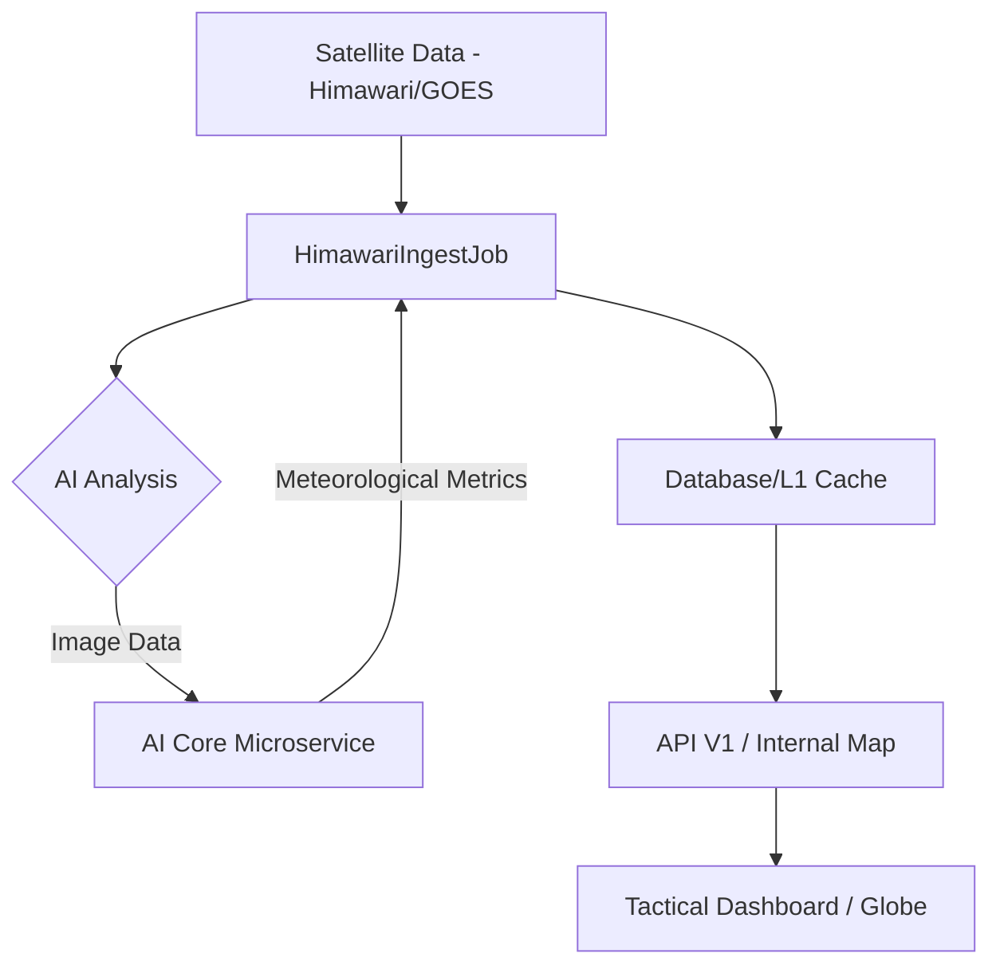

# System Architecture & Scaling Strategy

StarWeather is designed with a **Monolithic-Distributed Hybrid** architecture, leveraging Laravel's centralized processing power while distributing heavy tasks through Redis queues and dedicated processing nodes.

---

## [SVC] Service Ecosystem

The project is designed following a **Hybrid Microservices** model:

1.  **Core Backend (Laravel/PHP)**: Manages API, authentication, database, and task orchestration.
2.  **AI Core (FastAPI/Python)**: Specialized microservice handling Computer Vision and atmospheric physics calculations from satellite imagery.
3.  **Real-time Engine (WebSockets)**: Broadcasts satellite coordinates and instant warnings.

## [PIPE] Data Pipeline

1.  **Ingestion**: `HimawariIngestJob` downloads satellite images from public sources.
2.  **Analysis**: AI Core processes pixels to derive temperature, pressure, and wind speed.
3.  **Propagation**: `SatellitePropagateJob` calculates the next satellite position every second based on TLE.
4.  **Delivery**: Data is pushed to the frontend via API or WebSockets.

## Architectural Layers

The system is organized into 4 primary logical layers:

### 1. Ingestion Layer
Uses background daemon processes (Laravel Horizon) to maintain continuous connections with data providers:
- Orbital Stream: Connects to the NORAD API to retrieve the latest TLE data every 24 hours.
- Weather Stream: Polls Himawari-9 image data every 10 minutes to ensure the currency of the global cloud map.

### 2. Processing & Analytics Layer
This is where SGP4 algorithms and QAQC are executed:
- SGP4 Propagator: Converts orbital data into geographic coordinates.
- QA/QC Processor: Performs spatial consistency checks and physical constraint verification to remove data noise.

### 3. Distribution & Real-time Layer
Processed data is distributed through two channels:
- RESTful API: For third-party data integration.
- WebSocket (Laravel Reverb): Live broadcasts satellite positions to thousands of simultaneous users with extremely low latency.

---

## Scaling Strategy

StarWeather is optimized to run on powerful physical servers without virtualization, reducing overhead and increasing computational performance:

### 1. Multi-level Caching
- L1 Cache (Redis): Stores "Hot States" - the current state of all active satellites for instant retrieval.
- L2 Cache (Filesystem/CDN): Stores processed satellite image and radar files.

### 2. Queue Orchestration
Uses **Laravel Horizon** to monitor and coordinate hundreds of Workers. Tasks are allocated to queues with different priorities:
- `high`: Used for urgent storm warnings and critical risks.
- `satellite`: Used for periodic orbital calculations (Refer to [Orbit Algorithms](Algorithms)).
- `weather`: Used for heavy satellite image downloading and processing.

### 3. Big Data Handling
The `weather_metrics` table is designed to support **Table Partitioning** by month or year, allowing queries on billions of historical records without slowing down the system.
