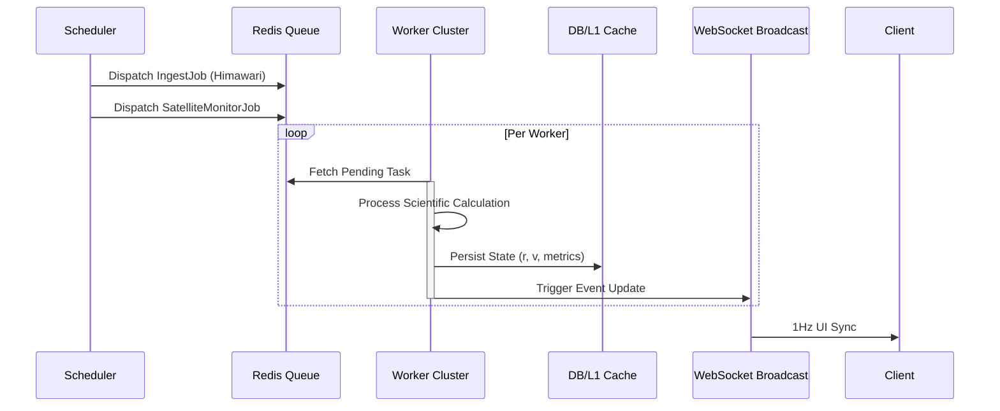
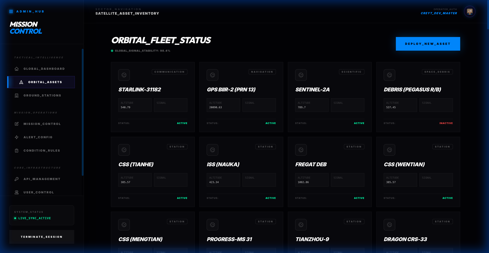
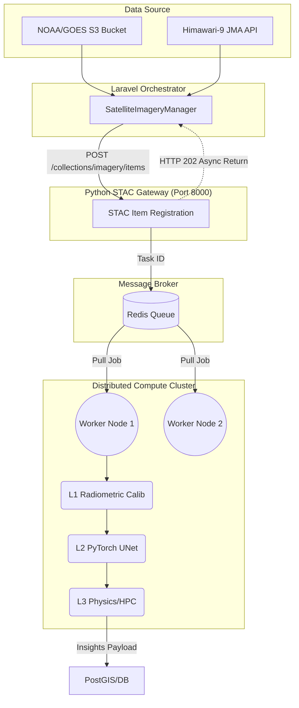
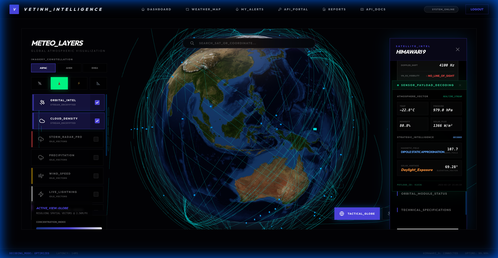

# System Architecture & Scaling Strategy

StarWeather is designed with a **Monolithic-Distributed Hybrid** architecture, leveraging Laravel's centralized processing power while distributing heavy tasks through Redis queues and dedicated processing nodes.

### [ORCHESTRATION] Async Pipeline Flow

---

## [SVC] Service Ecosystem

The project is designed following a **NASA-Compliant Hybrid Microservices** model:

1.  **Core Backend (Laravel/PHP)**: Manages authentication, database, and telemetry orchestration.
2.  **STAC API Gateway (FastAPI)**: Lightweight router that registers SpatioTemporal Asset Catalog (STAC) items and queues them instantly using HTTP 202.
3.  **Distributed Compute Nodes (Celery/Redis)**: Asynchronous workers running Deep Learning (PyTorch) and Zero-Copy HPC (C++) processing on satellite tiles.
4.  **Real-time Engine (WebSockets)**: Broadcasts satellite trajectory streams.

## [PIPE] DeepSky Enterprise Data Pipeline

1.  **Ingestion**: `SatelliteImageryManager` pulls the latest planetary tile from public S3/HTTP sources.
2.  **STAC Registration**: Laravel sends the URI to the FastAPI Gateway. The Gateway creates a STAC v1.0.0 Item, pushes it to Redis, and returns a Task ID.
3.  **Asynchronous Execution**: Idle Celery Worker Nodes pull the task from Redis, download the image directly to their RAM, and execute the 3-Tier Pipeline (L1->L3).
4.  **Delivery**: Results (Cloud Top Height, Cyclonic Intensity) are stored, ready for the Frontend Tactical Map to display.

## Architectural Layers

The system is organized into 4 primary logical layers:

### 1. Ingestion Layer
Uses background daemon processes (Laravel Horizon) to maintain continuous connections with data providers:
- Orbital Stream: Connects to the NORAD API to retrieve the latest TLE data every 24 hours.
- Weather Stream: Polls Himawari-9 image data every 10 minutes to ensure the currency of the global cloud map.

### 2. Processing & Analytics Layer
This is where SGP4 algorithms and QAQC are executed:
- SGP4 Propagator: Converts orbital data into geographic coordinates.
- QA/QC Processor: Performs spatial consistency checks and physical constraint verification to remove data noise.

### 3. Distribution & Real-time Layer
Processed data is distributed through two channels:
- RESTful API: For third-party data integration.
- WebSocket (Laravel Reverb): Live broadcasts satellite positions to thousands of simultaneous users with extremely low latency.

---

## Scaling Strategy

StarWeather is optimized to run on powerful physical servers without virtualization, reducing overhead and increasing computational performance:

### 1. Multi-level Caching
- L1 Cache (Redis): Stores "Hot States" - the current state of all active satellites for instant retrieval.
- L2 Cache (Filesystem/CDN): Stores processed satellite image and radar files.

### 2. Queue Orchestration
Uses **Laravel Horizon** to monitor and coordinate hundreds of Workers. Tasks are allocated to queues with different priorities:
- `high`: Used for urgent storm warnings and critical risks.
- `satellite`: Used for periodic orbital calculations (Refer to [Orbit Algorithms](Algorithms)).
- `weather`: Used for heavy satellite image downloading and processing.

### 3. Big Data Handling
The `weather_metrics` table is designed to support **Table Partitioning** by month or year, allowing queries on billions of historical records without slowing down the system.
