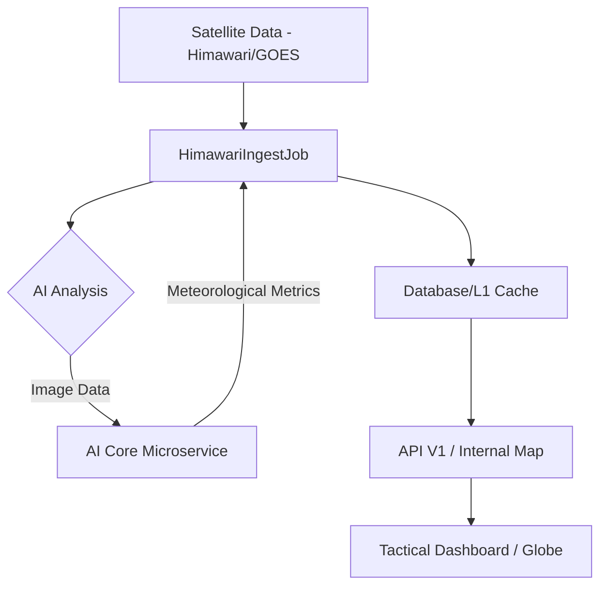

# Kiến Trúc Hệ Thống & Chiến Lược Mở Rộng

StarWeather được thiết kế theo kiến trúc **Monolithic-Distributed Hybrid**, tận dụng sức mạnh xử lý tập trung của Laravel đồng thời phân tán các tác vụ nặng thông qua hàng đợi Redis và các Node xử lý riêng biệt.

---

## [SVC] Hệ sinh thái Dịch vụ (Service Ecosystem)

Dự án được thiết kế theo mô hình **Hybrid Microservices**:

1.  **Core Backend (Laravel/PHP)**: Quản lý API, xác thực, cơ sở dữ liệu và điều phối task.
2.  **AI Core (FastAPI/Python)**: Microservice chuyên biệt xử lý Computer Vision và tính toán vật lý khí quyển từ ảnh vệ tinh.
3.  **Real-time Engine (WebSockets)**: Phát sóng tọa độ vệ tinh và cảnh báo tức thời.

## [PIPE] Luồng Dữ liệu (Data Pipeline)

1.  **Ingestion**: `HimawariIngestJob` tải ảnh vệ tinh từ các nguồn public.
2.  **Analysis**: AI Core xử lý pixel để derive ra nhiệt độ, áp suất và tốc độ gió.
3.  **Propagation**: `SatellitePropagateJob` tính toán vị trí vệ tinh tiếp theo mỗi giây dựa trên TLE.
4.  **Delivery**: Dữ liệu được đẩy lên frontend qua API hoặc WebSockets.

## Phân Lớp Kiến Trúc (Architectural Layers)

Hệ thống được tổ chức thành 4 phân lớp logic chính:

### 1. Lớp Ingestion (Thu Thập Dữ Liệu)
Sử dụng các tiến trình daemon chạy ngầm (Laravel Horizon) để duy trì kết nối liên tục với các trạm cung cấp dữ liệu:
- Orbital Stream: Kết nối với API của NORAD để lấy dữ liệu TLE mới nhất mỗi 24 giờ.
- Weather Stream: Polling dữ liệu ảnh Himawari-9 mỗi 10 phút để đảm bảo tính thời sự của bản đồ mây toàn cầu.

### 2. Lớp Processing & Analytics (Xử Lý & Phân Tích)
Đây là nơi thực thi các thuật toán SGP4 và QAQC:
- SGP4 Propagator: Chuyển đổi dữ liệu orbital thành tọa độ địa lý.
- QA/QC Processor: Thực hiện kiểm tra tính nhất quán không gian và rào cản vật lý để loại bỏ dữ liệu nhiễu.

### 3. Lớp Distribution (Phân Phối & Real-time)
Dữ liệu sau khi xử lý được đẩy ra ngoài thông qua hai kênh:
- RESTful API: Dành cho các bên thứ ba tích hợp dữ liệu.
- WebSocket (Laravel Reverb): Phát sóng trực tiếp vị trí vệ tinh cho hàng ngàn người dùng đồng thời với độ trễ cực thấp.

---

## Chiến Lược Mở Rộng (Scaling Strategy)

StarWeather được tối ưu hóa để chạy trên các server vật lý mạnh mẽ mà không cần ảo hóa, giúp giảm overhead và tăng hiệu năng tính toán:

### 1. Phân Cấp Bộ Nhớ Đệm (Multi-level Caching)
- L1 Cache (Redis): Lưu trữ "Hot States" - trạng thái hiện tại của tất cả vệ tinh đang hoạt động để truy xuất tức thì.
- L2 Cache (Filesystem/CDN): Lưu trữ các tệp tin hình ảnh vệ tinh và radar đã qua xử lý.

## [STOR] Hạ Tầng Lưu Trữ (Storage Infrastructure)

Dữ liệu hình ảnh (Imagery) từ vệ tinh và radar được quản lý tập trung tại:
- **Đường dẫn vật lý**: `storage/app/public/weather/`
- **Truy cập công khai**: `public/storage/weather/` (được liên kết qua symbolic link).
- **Quy tắc đặt tên**:
    - `himawari_latest.png`: Ảnh vệ tinh mới nhất phục vụ hiển thị thời gian thực trên Globe.
    - `himawari_YYYYMMDD_HHMMSS.png`: Dữ liệu lịch sử phục vụ tính năng Imagery History.

> [!NOTE]
> AI Core xử lý dữ liệu hoàn toàn trên RAM để đảm bảo hiệu suất tối đa, không lưu trữ dữ liệu trung gian tại thư mục cục bộ của Microservice.

### 2. Quản Lý Hàng Đợi (Queue Orchestration)
Sử dụng **Laravel Horizon** để giám sát và điều phối hàng trăm Worker. Các tác vụ được phân bổ vào các hàng đợi có ưu tiên khác nhau:
- `high`: Dùng cho các cảnh báo bão và rủi ro khẩn cấp.
- `satellite`: Dùng cho việc tính toán quỹ đạo định kỳ (Tham khảo [Thuật toán Orbit](Algorithms)).
- `weather`: Dùng cho việc tải và xử lý ảnh vệ tinh nặng.

### 3. Cấu Trúc Dữ Liệu Lớn (Big Data Handling)
Bảng `weather_metrics` được thiết kế để hỗ trợ **Table Partitioning** theo tháng hoặc năm, cho phép truy vấn dữ liệu lịch sử hàng tỷ bản ghi mà không làm chậm hệ thống.
