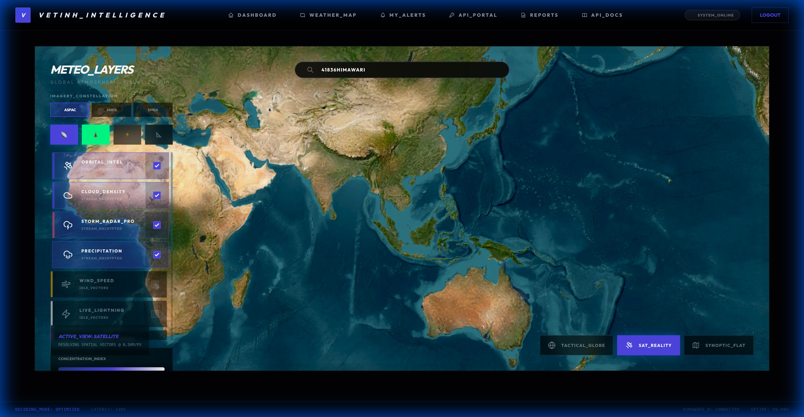
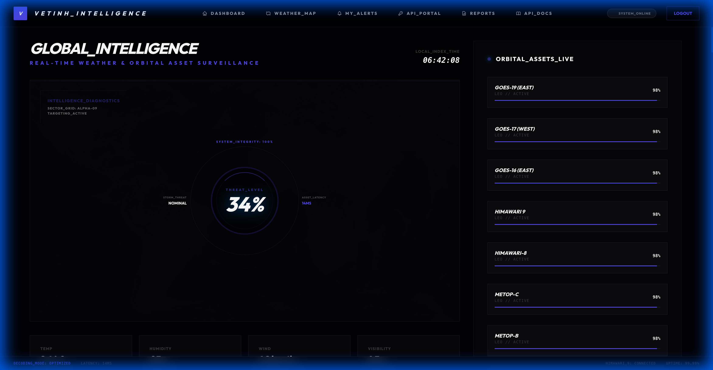
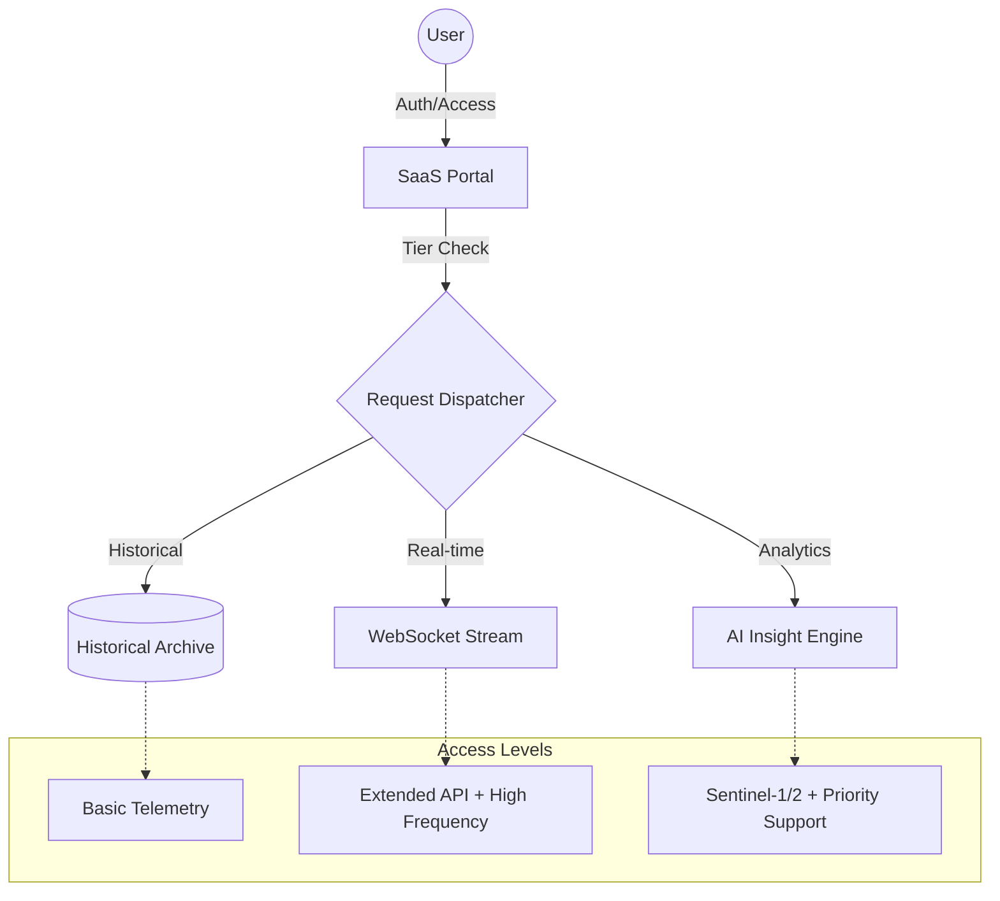

# StarWeather Documentation - System Overview

Welcome to the official technical documentation for StarWeather. This is an advanced satellite data analysis and weather forecasting platform, designed to serve the demanding requirements of enterprises and meteorological organizations.

## Project Vision

StarWeather was built with the goal of providing a comprehensive and accurate view of the Earth's state by combining data from multiple satellite sources and terrestrial observations. The system does not stop at data display; it performs complex mathematical calculations to provide risk indices and short-term forecasts.

## Customer Segments

The system is designed as a SaaS (Software as a Service) model, supporting multi-tenancy with flexible service plans:

1. Free Plan (FREE): For individual researchers with basic metrics.
2. Professional Plan (PRO): Provides faster data updates and expanded API access.

3. Enterprise Plan (ENTERPRISE): All features, including Sentinel-1/2 satellite data and priority technical support.
4. Government Plan (GOVERNMENT): Deep integration of weather radars and national-level warning systems.

### [PIPELINE] Service Architecture

## Main System Components

The system is divided into three primary architectural layers:

1. Ingestion Layer: Responsible for connecting to and retrieving raw data from aerospace and meteorological agencies.
2. Analytics & Intelligence Layer: Uses SGP4 algorithms and atmospheric physics models to convert raw data into actionable information.
3. Delivery Layer: Provided through an intuitive 3D Web interface and RESTful standard API endpoints.
