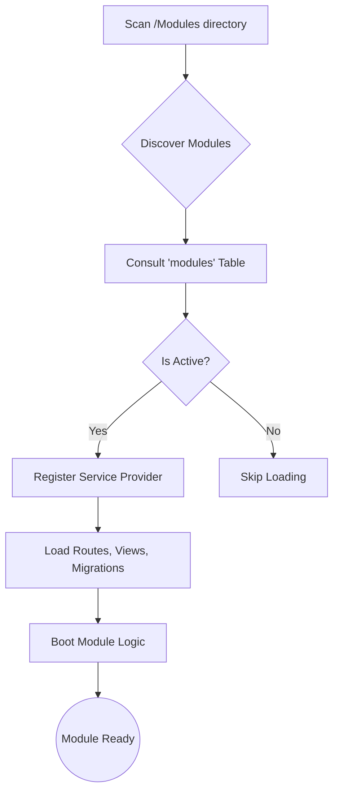

# Modular Architecture & Plug-and-Play System

The StarWeather platform features a sophisticated **Modular Architecture** that allows the system to be extended without modifying the core codebase. This enable a "Plug-and-Play" workflow where features can be uploaded, managed, and activated dynamically via the administrator interface.

---

### [LIFECYCLE] Module Activation Pipeline


---

## 1. Directory Structure
A standard module must follow the PSR-4 naming convention under the `Modules\` namespace.

```text
/Modules
  /SatellitePro
    /database
      /migrations      (Auto-loaded)
    /Providers
      SatelliteProServiceProvider.php (Main Entry Point)
    /resources
      /views           (Auto-loaded as satellitepro::*)
      /lang            (Auto-loaded)
    /routes
      web.php          (Auto-loaded)
      api.php          (Auto-loaded)
    module.json        (Module Manifest)
```

---

## 2. Data Structure Example (Manifest)

Each module contains a `module.json` file to communicate its requirements and metadata to the core system.

### [JSON] Example `module.json`
```json
{
    "name": "SatellitePro",
    "alias": "satellite-pro",
    "version": "1.0.0",
    "description": "Advanced telemetry visualization for deep-space assets.",
    "active": true,
    "providers": [
        "Modules\\SatellitePro\\Providers\\SatelliteProServiceProvider"
    ]
}
```

---

## 3. Database Management
The activation state is persisted in the `modules` table.

| Column | Type | Description |
| :--- | :--- | :--- |
| `id` | `BIGINT` | Primary Key. |
| `name` | `STRING` | Unique name of the module directory. |
| `is_active` | `BOOLEAN` | Toggles the loading of the module. |

---

## 4. Feature Integration

### Automated Route Discovery
The `ModuleServiceProvider` automatically detects routes in the `routes/` directory.

```php
// Modules/SatellitePro/routes/web.php
Route::get('/satellite-pro/dashboard', [SatelliteController::class, 'index']);
```

### Dynamic View Namespace
Views are accessible using the module's name as a lowercase prefix.

```php
// Loading a module view
return view('satellitepro::dashboard');
```

---
[🏠 Home](Home) | [🏗️ Architecture](Architecture) | [🔌 Modules](Modular-Architecture)
